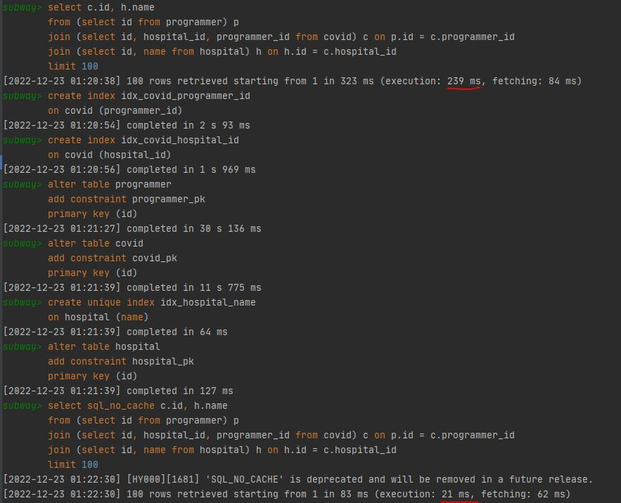
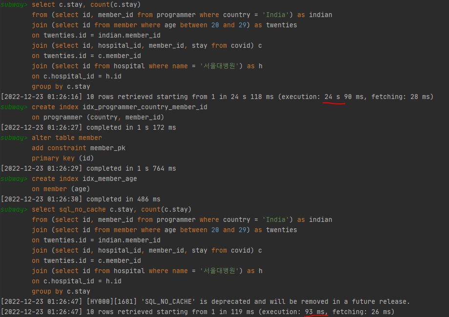
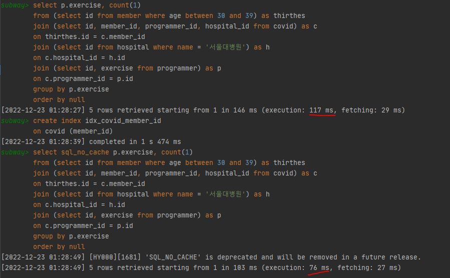

<p align="center">
    
</p>
<p align="center">
  
  
  <a href="https://edu.nextstep.camp/c/R89PYi5H" alt="nextstep atdd">
    
  </a>
  
</p>

<br>

# 인프라공방 샘플 서비스 - 지하철 노선도

<br>

## 🚀 Getting Started

### Install
#### npm 설치
```
cd frontend
npm install
```
> `frontend` 디렉토리에서 수행해야 합니다.

### Usage
#### webpack server 구동
```
npm run dev
```
#### application 구동
```
./gradlew clean build
```
<br>

## 미션

* 미션 진행 후에 아래 질문의 답을 작성하여 PR을 보내주세요.


### 1단계 - 화면 응답 개선하기
1. 성능 개선 결과를 공유해주세요 (Smoke, Load, Stress 테스트 결과)

2. 어떤 부분을 개선해보셨나요? 과정을 설명해주세요

---

### 2단계 - 스케일 아웃

1. Launch Template 링크를 공유해주세요.

2. cpu 부하 실행 후 EC2 추가생성 결과를 공유해주세요. (Cloudwatch 캡쳐)

```sh
$ stress -c 2
```

3. 성능 개선 결과를 공유해주세요 (Smoke, Load, Stress 테스트 결과)

---

### 3단계 - 쿼리 최적화

1. 인덱스 설정을 추가하지 않고 아래 요구사항에 대해 1s 이하(M1의 경우 2s)로 반환하도록 쿼리를 작성하세요.

- 활동중인(Active) 부서의 현재 부서관리자 중 연봉 상위 5위안에 드는 사람들이 최근에 각 지역별로 언제 퇴실했는지 조회해보세요. (사원번호, 이름, 연봉, 직급명, 지역, 입출입구분, 입출입시간)

```sql
# explain 실행계획

# +--+-----------+----------+----------+------+---------------------------------+-------------------------+-------+--------------------------+------+--------+---------------------------------------------------------+
# |id|select_type|table     |partitions|type  |possible_keys                    |key                      |key_len|ref                       |rows  |filtered|Extra                                                    |
# +--+-----------+----------+----------+------+---------------------------------+-------------------------+-------+--------------------------+------+--------+---------------------------------------------------------+
# |1 |PRIMARY    |<derived2>|NULL      |ALL   |NULL                             |NULL                     |NULL   |NULL                      |2     |100     |NULL                                                     |
# |1 |PRIMARY    |record    |NULL      |ref   |idx_record_record_symbol         |idx_record_record_symbol |3      |const                     |329467|10      |Using index condition                                    |
# |2 |DERIVED    |department|NULL      |index |PRIMARY,idx_department_id_note   |idx_department_id_note   |135    |NULL                      |9     |11.11   |Using where; Using index; Using temporary; Using filesort|
# |2 |DERIVED    |manager   |NULL      |ref   |PRIMARY,idx_manager_department_id|idx_manager_department_id|12     |tuning.department.id      |2     |10      |Using where                                              |
# |2 |DERIVED    |position  |NULL      |ref   |PRIMARY                          |PRIMARY                  |4      |tuning.manager.employee_id|1     |10      |Using where                                              |
# |2 |DERIVED    |salary    |NULL      |ref   |PRIMARY                          |PRIMARY                  |4      |tuning.manager.employee_id|9     |10      |Using where                                              |
# |2 |DERIVED    |employee  |NULL      |eq_ref|PRIMARY                          |PRIMARY                  |4      |tuning.manager.employee_id|1     |100     |NULL                                                     |
# +--+-----------+----------+----------+------+---------------------------------+-------------------------+-------+--------------------------+------+--------+---------------------------------------------------------+


select sql_no_cache                                                                                                                                                                                            e.last_name as 이름,
       t.annual_income as 직급명,
       t.position_name as 직급명,
       r.time as 입출입시간,
       r.region as 지역,
       r.record_symbol 입출입구분
from (
         select annual_income, employee_id
              , p.position_name
         from department d
                  inner join manager m on d.id = m.department_id
                  inner join salary s on m.employee_id = s.id
                  inner join position p on m.employee_id = p.id
         where d.note = 'active'
           and p.position_name='manager'
           and p.end_date = STR_TO_DATE('9999-01-01', '%Y-%m-%d')
           and m.end_date = STR_TO_DATE('9999-01-01', '%Y-%m-%d')
           and s.end_date = STR_TO_DATE('9999-01-01', '%Y-%m-%d')
         order by annual_income desc limit 5
     ) t
         join employee e on t.employee_id = e.id
         join record r on t.employee_id = r.employee_id
where r.record_symbol = 'O'
                                                                                                                                                                                                                       [2022-12-23 00:41:09] [HY000][1681] 'SQL_NO_CACHE' is deprecated and will be removed in a future release.
[2022-12-23 00:41:09] 14 rows retrieved starting from 1 in 387 ms (execution: 335 ms, fetching: 52 ms)

```

---

### 4단계 - 인덱스 설계

1. 인덱스 적용해보기 실습을 진행해본 과정을 공유해주세요

### Coding as a Hobby 와 같은 결과를 반환하세요.

#### index

```sql
create index idx_programmer_hobby
on programmer (hobby);
```

#### query

```sql
select h.hobby, count(1) / (select count(1) from programmer) * 100 as percent
from (select hobby from programmer) h
group by hobby;
```

#### explain

```sql
# +--+-----------+----------+----------+-----+--------------------+--------------------+-------+----+-----+--------+-----------+
# |id|select_type|table     |partitions|type |possible_keys       |key                 |key_len|ref |rows |filtered|Extra      |
# +--+-----------+----------+----------+-----+--------------------+--------------------+-------+----+-----+--------+-----------+
# |1 |PRIMARY    |programmer|NULL      |index|idx_programmer_hobby|idx_programmer_hobby|259    |NULL|71210|100     |Using index|
# |2 |SUBQUERY   |programmer|NULL      |index|NULL                |idx_programmer_hobby|259    |NULL|71210|100     |Using index|
# +--+-----------+----------+----------+-----+--------------------+--------------------+-------+----+-----+--------+-----------+
```


### 프로그래머별로 해당하는 병원 이름을 반환하세요. (covid.id, hospital.name)

#### index

```sql
create index idx_covid_programmer_id
on covid (programmer_id);

create index idx_covid_hospital_id
on covid (hospital_id);

alter table programmer
add constraint programmer_pk
primary key (id);

alter table covid
add constraint covid_pk
primary key (id);

create unique index idx_hospital_name
on hospital (name);

alter table hospital
add constraint hospital_pk
primary key (id);
```

#### query

```sql
select c.id, h.name
from (select id from programmer) p
join (select id, hospital_id, programmer_id from covid) c on p.id = c.programmer_id
join (select id, name from hospital) h on h.id = c.hospital_id
limit 100;
```

#### explain

```sql
# +--+-----------+----------+----------+------+---------------------------------------------+-----------------------+-------+--------------------+-----+--------+-----------+
# |id|select_type|table     |partitions|type  |possible_keys                                |key                    |key_len|ref                 |rows |filtered|Extra      |
# +--+-----------+----------+----------+------+---------------------------------------------+-----------------------+-------+--------------------+-----+--------+-----------+
# |1 |SIMPLE     |programmer|NULL      |index |PRIMARY                                      |idx_programmer_hobby   |259    |NULL                |74465|100     |Using index|
# |1 |SIMPLE     |covid     |NULL      |ref   |idx_covid_programmer_id,idx_covid_hospital_id|idx_covid_programmer_id|9      |subway.programmer.id|3    |100     |Using where|
# |1 |SIMPLE     |hospital  |NULL      |eq_ref|PRIMARY                                      |PRIMARY                |4      |func                |1    |100     |Using where|
# +--+-----------+----------+----------+------+---------------------------------------------+-----------------------+-------+--------------------+-----+--------+-----------+
```


### 프로그래밍이 취미인 학생 혹은 주니어(0-2년)들이 다닌 병원 이름을 반환하고 user.id 기준으로 정렬하세요. (covid.id, hospital.name, user.Hobby, user.DevType, user.YearsCoding)

#### query

```sql
select c.id,
       h.name,
       student_or_junior.hobby,
       student_or_junior.dev_type,
       student_or_junior.years_coding
from (select id, years_coding, hobby, dev_type
      from programmer
      where (years_coding = '0-2 years' or student in ('Yes, full-time', 'Yes, part-time'))
      and hobby = 'Yes') student_or_junior
join (select id, hospital_id, programmer_id from covid) c
on student_or_junior.id = c.programmer_id
join (select id, name from hospital) h
on h.id = c.hospital_id
order by student_or_junior.id
limit 100;
```

#### explain
```sql
# +--+-----------+----------+----------+------+---------------------------------------------+-----------------------+-------+--------------------+-----+--------+----------------------------------+
# |id|select_type|table     |partitions|type  |possible_keys                                |key                    |key_len|ref                 |rows |filtered|Extra                             |
# +--+-----------+----------+----------+------+---------------------------------------------+-----------------------+-------+--------------------+-----+--------+----------------------------------+
# |1 |SIMPLE     |programmer|NULL      |ref   |PRIMARY,idx_programmer_hobby                 |idx_programmer_hobby   |259    |const               |37232|28      |Using index condition; Using where|
# |1 |SIMPLE     |covid     |NULL      |ref   |idx_covid_programmer_id,idx_covid_hospital_id|idx_covid_programmer_id|9      |subway.programmer.id|3    |100     |Using where                       |
# |1 |SIMPLE     |hospital  |NULL      |eq_ref|PRIMARY                                      |PRIMARY                |4      |func                |1    |100     |Using where                       |
# +--+-----------+----------+----------+------+---------------------------------------------+-----------------------+-------+--------------------+-----+--------+----------------------------------+
```


### 서울대병원에 다닌 20대 India 환자들을 병원에 머문 기간별로 집계하세요. (covid.Stay)

#### index

```sql
create index idx_programmer_country_member_id
on programmer (country, member_id);

alter table member
add constraint member_pk
primary key (id);

create index idx_member_age
on member (age);
```

#### query

```sql
select c.stay, count(c.stay)
from (select id, member_id from programmer where country = 'India') as indian
join (select id from member where age between 20 and 29) as twenties
on twenties.id = indian.member_id
join (select id, hospital_id, member_id, stay from covid) c
on twenties.id = c.member_id
join (select id from hospital where name = '서울대병원') as h
on c.hospital_id = h.id
group by c.stay;
```

#### explain
```sql
# +--+-----------+----------+----------+------+--------------------------------+--------------------------------+-------+----------------------------+-----+--------+--------------------------------------------+
# |id|select_type|table     |partitions|type  |possible_keys                   |key                             |key_len|ref                         |rows |filtered|Extra                                       |
# +--+-----------+----------+----------+------+--------------------------------+--------------------------------+-------+----------------------------+-----+--------+--------------------------------------------+
# |1 |SIMPLE     |hospital  |NULL      |const |PRIMARY,idx_hospital_name       |idx_hospital_name               |1023   |const                       |1    |100     |Using index; Using temporary; Using filesort|
# |1 |SIMPLE     |covid     |NULL      |ref   |idx_covid_hospital_id           |idx_covid_hospital_id           |9      |const                       |10173|100     |Using index condition; Using where          |
# |1 |SIMPLE     |programmer|NULL      |ref   |idx_programmer_country_member_id|idx_programmer_country_member_id|1032   |const,subway.covid.member_id|1    |100     |Using index                                 |
# |1 |SIMPLE     |member    |NULL      |eq_ref|PRIMARY,idx_member_age          |PRIMARY                         |8      |subway.covid.member_id      |1    |47.92   |Using where                                 |
# +--+-----------+----------+----------+------+--------------------------------+--------------------------------+-------+----------------------------+-----+--------+--------------------------------------------+
```


### 서울대병원에 다닌 30대 환자들을 운동 횟수별로 집계하세요. (user.Exercise)

#### index

```sql
create index idx_covid_member_id
on covid (member_id);
```

#### query

```sql
select p.exercise, count(1)
from (select id from member where age between 30 and 39) as thirthes
join (select id, member_id, programmer_id, hospital_id from covid) as c
on thirthes.id = c.member_id
join (select id from hospital where name = '서울대병원') as h
on c.hospital_id = h.id
join (select id, exercise from programmer) as p
on c.programmer_id = p.id
group by p.exercise
order by null;
```

#### explain
```sql
# +--+-----------+----------+----------+------+-----------------------------------------------------------------+---------------------+-------+--------------------------+-----+--------+----------------------------------+
# |id|select_type|table     |partitions|type  |possible_keys                                                    |key                  |key_len|ref                       |rows |filtered|Extra                             |
# +--+-----------+----------+----------+------+-----------------------------------------------------------------+---------------------+-------+--------------------------+-----+--------+----------------------------------+
# |1 |SIMPLE     |hospital  |NULL      |const |PRIMARY,idx_hospital_name                                        |idx_hospital_name    |1023   |const                     |1    |100     |Using index; Using temporary      |
# |1 |SIMPLE     |covid     |NULL      |ref   |idx_covid_programmer_id,idx_covid_hospital_id,idx_covid_member_id|idx_covid_hospital_id|9      |const                     |10173|100     |Using index condition; Using where|
# |1 |SIMPLE     |member    |NULL      |eq_ref|PRIMARY,idx_member_age                                           |PRIMARY              |8      |subway.covid.member_id    |1    |43.16   |Using where                       |
# |1 |SIMPLE     |programmer|NULL      |eq_ref|PRIMARY                                                          |PRIMARY              |8      |subway.covid.programmer_id|1    |100     |NULL                              |
# +--+-----------+----------+----------+------+-----------------------------------------------------------------+---------------------+-------+--------------------------+-----+--------+----------------------------------+
```



---

### 추가 미션

1. 페이징 쿼리를 적용한 API endpoint를 알려주세요
